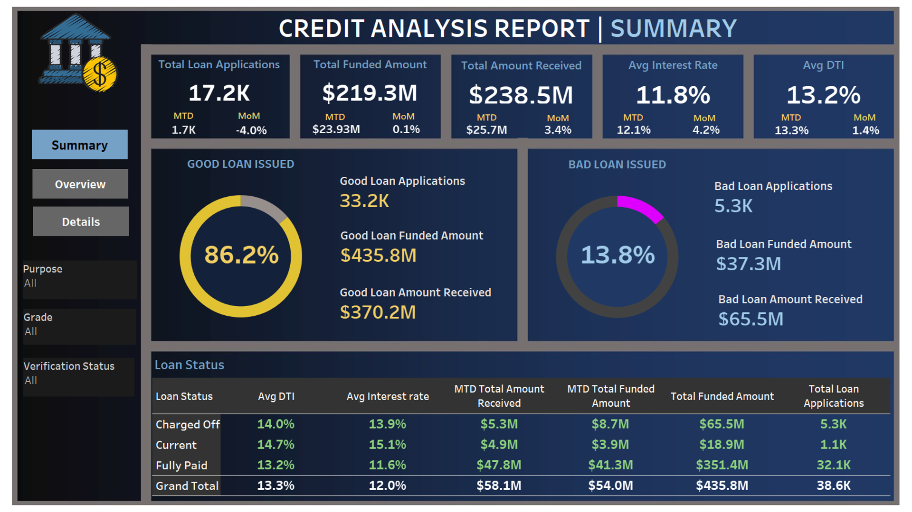

# Bank Loan Analysis
 
# Analysis of Amazon-Netflix-Performance in Tableau
Link to Tableau file - [Download Visualization Twbx File](Project.twbx)

## Project Objectives:
- Get an overview  of content produced by Netflix and Amazon Prime
-  Reviewing the work of Directors based on genre, content type(movies or TV shows ), and number of shows produced over the years
- Effect of COVID-19 on the amount of content produced and its subsequent effect on the stocks of these companies

## Dashboards

